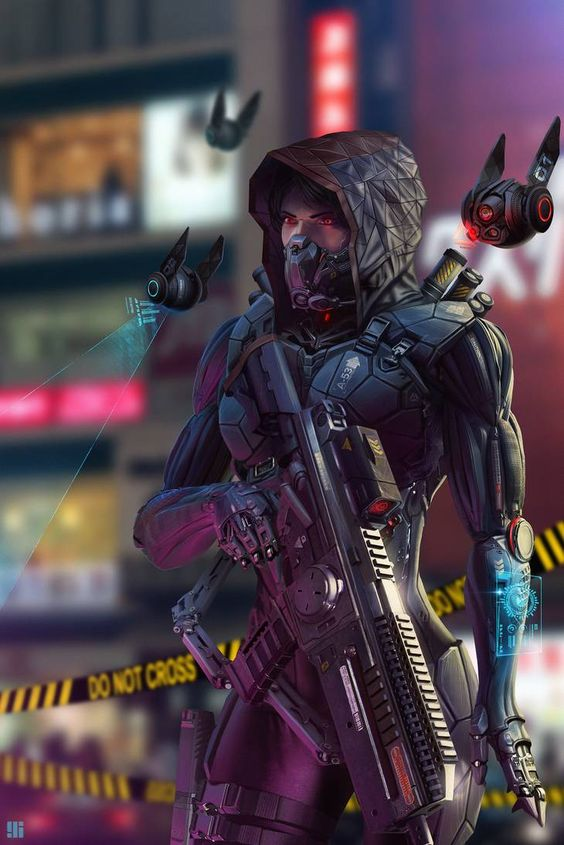
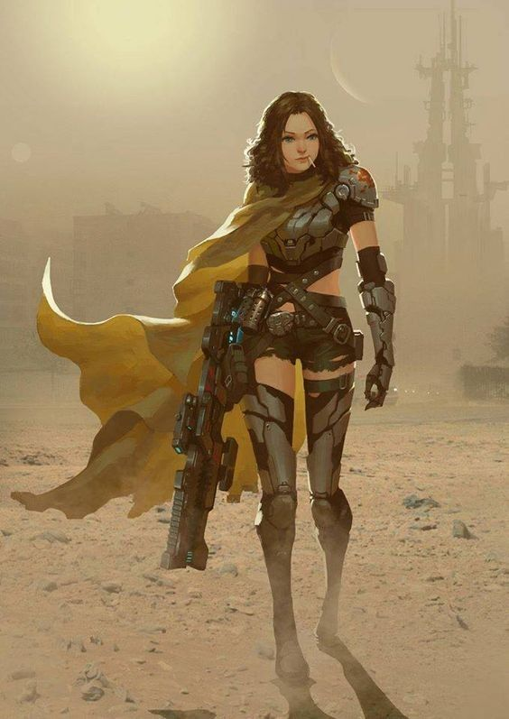

Overwatch:
1. Класс штурмовик
   1. Основное оружие снайперская винтовка - наносит большой урон. Имеет возможность убийства с одного выстрела в голову, если у противника менее 70% здоровья. Имеет долгую перезарядку - 1-1.5 секунды
   1. Дополнительное оружие портальная пушка - имеет возможность поставить 2 портала связанных друг с другом в любом месте карты на 3 секунды, раз в 10 секунд - в портал может пройти любой игрок. Компенсирует низкое здоровье персонажа.
   1. Ультимативная способность - создает клона персонажа с запасом здоровья который отвлекает соперников пока основной персонаж становится невидимым и может отойти из-под атаки. Невидимость действует 8 секунд. Клон персонажа живет 15 секунд, либо до потери всех жизней.
   1. Воин, девушка, прибыла из будущего. Имеет футуристичный вид, примерные дизайны в приложены картинках. Основа из первой картинки. Добавить плащ со второй, поменять цвет на темно красный/бордовый. Снайперская винтовка - основа с первой картинки. Удлинить ствол оружия - длинный и узкий:  
   3. В будущем наш мир попал под полный контроль корпораций, контролирующих все земные ресурсы так, что не осталось места для жизни обычных людей и лишь небольшая группа повстанцев попыталась побороть устоявшийся порядок, организовав полноценное сопротивление, но проиграла эту битву. В тяжелой борьбе сопротивление понесло большие потери и было практически уничтожено. В попытке спастись некоторым повстанцам удалось перенастроить свое портальное оружие для перемещения в прошлое и стать наемниками для уничтожения зачатков контроля над земными ресурсами.
   4. Атака на большом расстоянии с возможностью занять хорошие точки обзора для атаки, использую порталы для перемещения по карте. Дополнительно порталы так же могут стать оружием и помогут выкидывать соперников с карты или же переносить их к своей команде для устранений. Персонаж обладает хорошей выживаемостью (перемещение по карте плюс ультимативная способность позволяющая выйти из боя и восстановиться) и большим уроном (headshot).

2. Персонажу1 потребуется примерно 7.1 секунды на убийство второго персонажа. Персонажу 2 потребуется около 5.2 секунды на убийства первого персонажа. От сюда можно предположить, что задержка для второго персонажа должна быть отношением между 7.1 и 5.2, то есть примерно 1.4 секунды
